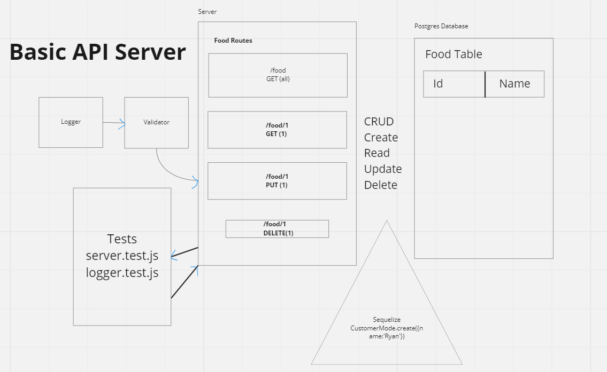

# LAB - Class 03

## Project: Basic API Server

### Author: Jacob Dang

### Problem Domain
Building a REST API using Express. Must utilize endpoints that perform CRUD operations on a database and fit the REST standard.

### Links & Resources
{GitHub Actions} {URL}
{Deployed Database} {}

see '.env.sample'

### Features/Routes:
- Feature One:
    - Basic Error Handlers/Testers
- Feature Two:
    - Status Codes within CRUD operations

- Feature Three:
    - ROUTES: GET, UPDATE, DELETE

#### Tests
- How do you run tests?
    - npm i

- Any tests of note:
    - Use a external client to access database

## UML
